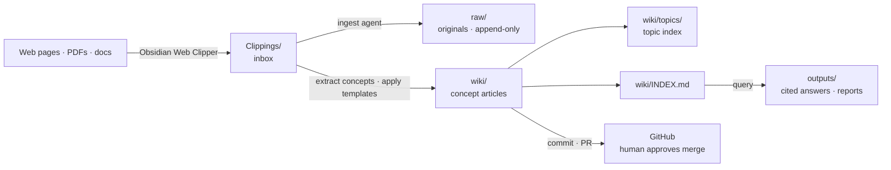

# 2nd-brain — An AI Second Brain Vault for Obsidian, Run by Claude Code

[한국어](README.md) · **English**

> A personal and team knowledge management (PKM) vault template where an AI agent **compiles clipped web sources into structured wiki articles**, then answers your questions from that wiki **with citations**. Everything is Markdown and Git — no vendor lock-in — and the rules are model-neutral, so Claude, GPT, or Codex can all drive it.


[](https://obsidian.md)
[](https://claude.com/claude-code)
[](https://commonmark.org)
[](https://git-scm.com)
[](LICENSE)

**Keywords**: Obsidian second brain · personal knowledge management (PKM) · AI knowledge base · markdown wiki automation · web clipper ingest pipeline · Claude Code agent skills · PARA method · Zettelkasten · cited Q&A over your notes

---

## Contents

- [The problem it solves](#the-problem-it-solves)
- [Features](#features)
- [How it works](#how-it-works)
- [Directory structure](#directory-structure)
- [Requirements](#requirements)
- [Getting started](#getting-started)
- [Usage](#usage)
- [Rules and contracts](#rules-and-contracts)
- [Skills](#skills)
- [FAQ](#faq)

## The problem it solves

Reading material piles up, but saved articles are never revisited. Bookmarks and clipping folders end up as **a heap of unread originals**, and when you actually need something you are back to "where did I read that?".

This vault inserts a **compile step** in between. Originals are preserved untouched in `raw/`, and an AI agent extracts the concepts into wiki articles — one concept per file. From then on you ask questions against the **organized wiki**, not the heap, and every answer links back to its sources.

- **Preservation and interpretation are separated** — `raw/` is append-only; interpretation lives in `wiki/`
- **Verifiable answers** — answers cite their source articles, and weakly-supported claims are flagged `needs-update`
- **Built for a team** — every change arrives as a Git branch and PR; a human approves the merge
- **Agents follow the rules** — the contract lives in one file (`VAULT_RULES.md`) that humans and LLMs both read

## Features

| Feature | What it does |
| --- | --- |
| **Clipping ingest** | Compiles sources collected in `Clippings/` (via Obsidian Web Clipper) into wiki articles as one daily batch |
| **PDF ingest** | Converts PDFs to Markdown with a strategy matched to per-page text density and drops them into `Clippings/` (`pdf2md-ingest`) |
| **HWP ingest** | Converts Korean HWP/HWPX documents to Markdown — no Hancom Office required — and drops them into `Clippings/` (`hwp2md-ingest`) |
| **Document promotion** | Promotes team/personal repo docs — reusable concepts to wiki, original snapshots to `raw/` (`vault-promote`) |
| **Cited Q&A** | Answers from `wiki/INDEX.md` and saves retained answers to `outputs/` |
| **Quality lint** | Detects stubs, contradictions, broken links, and frontmatter violations, files a report, and regenerates the `raw/` index |
| **Invariant verification** | Every write lane (ingest, lint, promote) checks the shared invariants — memory under 8 KB, `raw/`/`archive/` append-only — through one script, `vault_verify.py` |
| **Weekly report** | Aggregates the last week from full git statistics into `areas/weekly/` as Markdown plus an email-ready HTML view |
| **Private notes** | `private/` is a git-untracked local scratch space, separating personal memos from the shared vault |
| **GitHub-linked projects** | Tracks external repos as lightweight status/goal notes under `projects/@<org>/<repo>/` |
| **Agent context budget** | Caps the always-loaded rule set at 8 KB so instructions never crowd out the actual work |

## How it works



Ingest runs as **one daily batch**, not once per clipping. The agent creates an `ingest/<date>-<author>` branch, moves originals to `raw/`, writes the wiki, updates the indexes, and opens a PR. Opening the PR is automatic; **merging requires explicit human approval**.

## Directory structure

```text
Clippings/        ← inbox: newly scraped sources (pending processing)
raw/              ← processed source originals (append-only; no edits, renames, or deletes)
wiki/             ← concept articles, one concept per file
wiki/topics/      ← topic index pages (subject clusters)
outputs/          ← query answers, analysis reports, lint results
projects/<name>/  ← per-project execution context, config, and outputs
areas/            ← ongoing areas: daily/ notes, weekly/ reports, ideas/ notes
templates/        ← Obsidian + LLM output templates (shared contracts)
archive/          ← completed projects and superseded material (append-only)
docs/             ← system docs: setup guide, raw/ contract, GitHub-link contract
private/          ← personal scratch space (git-untracked)
```

`projects/`, `areas/`, and `archive/` follow the [PARA](https://fortelabs.com/blog/para/) method, with `wiki/` serving as the reusable-concept layer (the "R").

> `raw/` and `archive/` are append-only. `wiki/VAULT_MEMORY.md` and `wiki/INDEX.md` load at the start of every vault operation.

## Requirements

| Tool | Required | Purpose |
| --- | --- | --- |
| [Git](https://git-scm.com) | Required | clone, branch, commit, push |
| [Obsidian](https://obsidian.md) | Required | edit the markdown vault, Web Clipper & plugins |
| [Claude CLI](https://claude.com/claude-code) (`claude`) | Optional | delegate ingest/lint to Claude Code (falls back to Hermes without it) |
| [GitHub CLI](https://cli.github.com) (`gh`) | Optional | create PRs / link GitHub projects from the terminal (web works too) |
| Python 3 | Optional | one-shot ingest runner (`vault_ingest_once.py`), invariant verifier (`vault_verify.py`), and `raw/` index generation (`generate_raw_index.py`) |

Version check:

```bash
git --version        # required
claude --version     # optional
gh --version         # optional
```

## Getting started

1. **Clone the repo and set `VAULT_DIR`** — the repo and path below are examples. After cloning, repoint `origin` to your own/team git, and use `$VAULT_DIR`/`~` relative paths instead of absolute machine paths.

   ```bash
   git clone https://github.com/lemoncloud-io/2nd-brain.git ~/knowledge
   export VAULT_DIR="$HOME/knowledge"
   cd "$VAULT_DIR"
   ```

2. **Open the cloned folder as an Obsidian vault** — use `Open folder as vault` and pick `~/knowledge`. You should see `VAULT_RULES.md`, `wiki/`, and `templates/`.

3. **Replace the deployment values** — org- and person-specific values live in one settings file, never in skill bodies.

   ```bash
   $EDITOR projects/second-brain/config/team-settings.yaml
   # vault.name · github.vault_repo · github.default_reviewer · mail.weekly_report.to
   ```

4. **(Optional) Install the Claude CLI** — to delegate ingest/lint to Claude Code, `claude` must be installed and authenticated. Without it, the agent falls back to the Hermes-native workflow.

> For the **full setup and usage guide** — Obsidian Web Clipper, plugins, the PR workflow, and troubleshooting — see [`docs/knowledge-wiki-setup-guide.md`](docs/knowledge-wiki-setup-guide.md).

### Vault root rule

Treat the repository root as `VAULT_DIR` only when the expected structure is present (`VAULT_RULES.md`, `wiki/`, `raw/`, `Clippings/`, `outputs/`, and `templates/`). Use a user-provided `VAULT_DIR` when set. Never silently fall back to `~/knowledge` — that is only an example setup path. Full rule: [`CLAUDE.md`](CLAUDE.md) § Vault Root.

## Usage

### Ingest clippings

Drop markdown into `Clippings/` and run:

```text
클리핑 처리해줘   (process clippings)
```

To force delegation to Claude Code:

```text
Claude에 위임해서 클리핑 처리해줘   (delegate to Claude Code)
```

Ingest and lint prefer Claude Code when the `claude` CLI is installed and authenticated. If Claude Code is unavailable, blocked, or unauthenticated, the agent reports why and runs the Hermes-native fallback instead of failing silently.

#### What to expect on the first run

Drop one source into `Clippings/` (e.g. an article on a multi-agent setup) and run it. The agent will:

- Create an `ingest/<YYYY-MM-DD>-<author-slug>` branch off `master` (re-runs on the same day get a `-2`, `-3` suffix)
- Move each processed clipping from `Clippings/` to `raw/` unchanged, normalizing only the filename ([`docs/raw-layout.md`](docs/raw-layout.md))
- Create `wiki/` concept articles from `templates/` (e.g. `multi-agent-orchestration`) and add new topics under `wiki/topics/` as needed
- Update `wiki/INDEX.md` and `wiki/TOPIC_MAP.md`, write this run's log as a note under `outputs/runs/`, and replace the single `Last Ingest` line in `wiki/VAULT_MEMORY.md` (8 KB budget)
- Commit, push, and open a PR against `master` automatically (reviewer = `github.default_reviewer` in `team-settings.yaml`)

New articles usually start as `stub`, and time-sensitive or under-supported claims are flagged `needs-update`. When it finishes, you get a summary of processed clippings, created/updated articles, remaining issues, and the PR link.

#### Scheduled runs (cron · webhook)

To run ingest on a schedule instead of by request, the `vault-ingest-once` skill is the entry point. From the vault root:

```bash
python3 projects/second-brain/config/scripts/vault_ingest_once.py
```

The script checks for pending clippings, the lock, and Claude CLI availability, and reports a status: `no_work` (nothing to process), `claude_success` (the shared-invariant check has already passed — its output is in the `verify` field), `fallback_required` / exit 42 (run the Hermes-native fallback), `locked` (never run in parallel), `claude_failed_after_start` (partial changes possible — no automatic fallback; review the changed files first), or `verify_failed` (the commit and PR exist, but invariant verification failed — do not report success; fix the defects on the PR, never re-run automatically).

The script carries no copy of the job spec handed to Claude — the "Claude job spec" block in [`vault-ingest-claude.md`](projects/second-brain/config/skills/vault-ingest-claude.md) is the single source of truth for both the delegated and the interactive lane. A cron prompt seed is included in [`vault-ingest-once.md`](projects/second-brain/config/skills/vault-ingest-once.md).

### Query

Ask any question — the agent reads `wiki/INDEX.md`, identifies relevant articles, and writes a cited answer to `outputs/`.

### Weekly report

```text
주간 보고   (weekly report)
```

Aggregates the last 7 days of git history into `areas/weekly/YYYY-MM-DD.md` plus an email-ready `.html` view. Numbers come from commands, not curation, and the report records the commands it used.

### Private notes

```text
오늘 private 노트 시작해줘   (start today's private note)
```

Writes to `private/YYYY-MM-DD.md`, which is gitignored and never reaches the shared repo.

## Rules and contracts

Humans and LLMs read the same documents. Each one owns a different layer.

| Document | Owns |
| --- | --- |
| [`VAULT_RULES.md`](VAULT_RULES.md) | Directory contract, note contracts, language convention, workflows — **the authoritative contract** |
| [`CLAUDE.md`](CLAUDE.md) | Session read order, `VAULT_DIR` resolution, hard invariants |
| [`AGENTS.md`](AGENTS.md) | Agent entry point (model-neutral) |
| [`wiki/VAULT_MEMORY.md`](wiki/VAULT_MEMORY.md) | Current state and pointers. Loaded every session, **8 KB cap** |
| [`docs/raw-layout.md`](docs/raw-layout.md) | `raw/` lanes, append-only definition, filename normalization, index |
| [`docs/github-linked-projects.md`](docs/github-linked-projects.md) | Contract for tracking external GitHub repos |
| [`docs/vault-ingest-log.md`](docs/vault-ingest-log.md) | Historical execution ledger (frozen — new run logs are notes under `outputs/runs/`) |
| [`projects/second-brain/config/team-settings.yaml`](projects/second-brain/config/team-settings.yaml) | Single source for org/personal deployment values |

## Skills

The skill documents in `projects/second-brain/config/skills/` are the source of truth for each workflow. Folder-style skills (`pdf2md-ingest`, `hwp2md-ingest`) are exposed to Claude Code automatically through symlinks in `.claude/skills/`.

| Skill | Role |
| --- | --- |
| `vault-ingest-claude` | Preferred ingest path (Claude Code) |
| `vault-ingest` | Hermes-native ingest fallback |
| `vault-ingest-once` | One-shot ingest entry point shared by manual, cron, and webhook runs (`vault_ingest_once.py`) |
| `pdf2md-ingest` | Converts PDFs to Markdown and drops them into `Clippings/` — measures text density, proposes a strategy (pymupdf4llm, local OCR, or Claude vision transcription); the regular ingest takes it from there |
| `hwp2md-ingest` | Converts HWP/HWPX to Markdown and drops it into `Clippings/` — pure-Python extraction first (no Hancom Office), Claude vision transcription fallback for text-sparse documents; an out-of-vault mode handles documents that must not be committed |
| `vault-promote` | Promotes team/personal repo docs into the vault — reusable concepts to wiki, an original snapshot to `raw/` (a separate lane from clipping ingest) |
| `vault-query` | Answer from wiki, save retained answers to `outputs/` |
| `vault-lint` | Claude-first lint with Hermes-native fallback |
| `vault-weekly-report` | Weekly report from full git statistics (`areas/weekly/`) |
| `private-note` | Untracked personal notes (`private/YYYY-MM-DD.md`) |
| `github-project-link` / `github-project-sync` | Register and sync external GitHub repos |
| `google-workspace` | Search, read, and edit Google Drive/Sheets/Slides docs via the workspace-mcp server |
| `ollama-local-models` | General procedure for installing, serving, and calling local LLMs/VLMs with Ollama |
| `parallel-wp-orchestration` | Decompose multi-repo/module work into parallel sub-agent work packages, run, and integrate |
| `ai-studio-project-onboarding` | Onboard a Google AI Studio export: settle it into local git, register it in the vault, and plan local development |

## Projects

- [second-brain](projects/second-brain/) — `active` · continuously improving this vault's structure and workflow

The source of truth for a project's status, due date, and next action is the frontmatter of its own README. See [projects/README.md](projects/README.md) for details.

## FAQ

**Do I need Obsidian?**
No. The vault is just Markdown files in a Git repository, and agents read and write them with plain file tools. Obsidian is recommended for the graph view, backlinks, and Web Clipper.

**Does it require Claude Code?**
No. The rules are written to be model-neutral, so any LLM that can read and write files can follow the same contract. Without the Claude CLI, the agent runs the Hermes-native fallback.

**Can I add this to an existing Obsidian vault?**
Yes. Copy `VAULT_RULES.md`, `CLAUDE.md`, `templates/`, and `projects/second-brain/config/` into your vault, then create the `Clippings/`, `raw/`, `wiki/`, and `outputs/` folders. Your existing notes are left alone.

**Where is my data stored?**
Entirely in your local Git repository. Nothing is uploaded to a third-party service by the vault itself; what reaches an agent is scoped to the task you run. Keep anything you don't want shared in `private/` (git-untracked).

**Can I use it solo?**
Yes, though the default rules assume a shared team vault — for example, personal experiment data and per-item labels over personal media must not be committed. Running solo, you can relax those clauses in `VAULT_RULES.md`.

**Why compile wiki articles instead of just searching the originals?**
Full-text search only finds what lives inside a single document. The wiki layer gathers the same concept from several sources into one article and links concepts to each other, which is what makes multi-source questions answerable.

## Related concepts

Personal Knowledge Management (PKM) · Second Brain · Zettelkasten · PARA Method · Obsidian vault · Markdown wiki · AI agent skills · Retrieval-grounded Q&A · Knowledge base automation

## Contributing

This repository is a bootstrap template — clone it and repoint `origin` to your own or your team's repository. Suggestions are welcome as issues or PRs.

## License

[MIT](LICENSE) — clone, modify, and redistribute freely. The license covers the vault template (rules, skills, templates, scripts), not the notes you write into your own vault.
