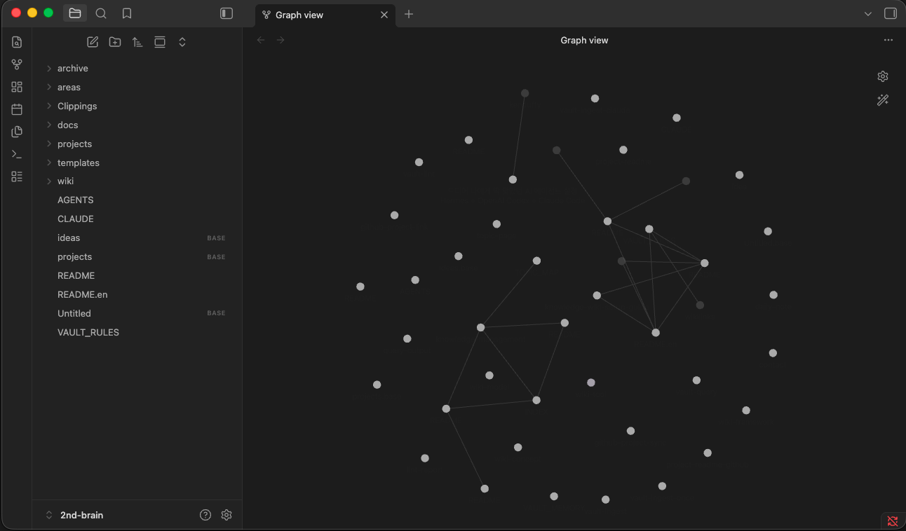
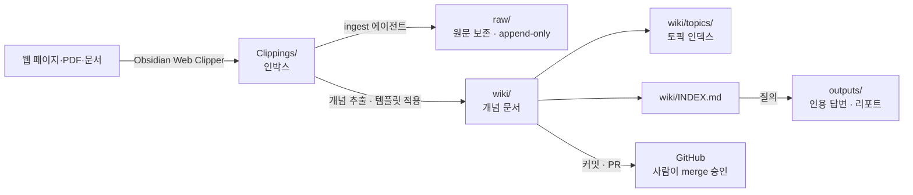

# 2nd-brain — Obsidian + Claude Code로 운영하는 AI Second Brain Vault

**한국어** · [English](README.en.md)

> 웹에서 클리핑한 원문을 AI 에이전트가 **구조화된 위키 문서로 컴파일**하고, 그 위키를 근거로 **출처가 달린 답변**을 만들어 주는 Obsidian 기반 개인·팀 지식 관리(PKM) vault 템플릿. 마크다운과 Git만 쓰므로 벤더 종속이 없고, 규칙은 모델 중립적이라 Claude·GPT·Codex 어느 쪽으로도 굴릴 수 있다.



[](https://obsidian.md)
[](https://claude.com/claude-code)
[](https://commonmark.org)
[](https://git-scm.com)
[](LICENSE)

**키워드**: Obsidian second brain · 세컨드 브레인 · 제2의 뇌 · 개인 지식 관리(PKM) · AI 지식 베이스 · 마크다운 위키 자동 생성 · 웹 클리퍼 인제스트 · Claude Code agent skills · PARA 노트 정리법

---

## 목차

- [무엇을 해결하는가](#무엇을-해결하는가)
- [핵심 기능](#핵심-기능)
- [동작 방식](#동작-방식)
- [디렉터리 구조](#디렉터리-구조)
- [필요한 도구](#필요한-도구)
- [설치 및 시작](#설치-및-시작)
- [사용법](#사용법)
- [규칙과 계약](#규칙과-계약)
- [스킬](#스킬)
- [자주 묻는 질문](#자주-묻는-질문)

## 무엇을 해결하는가

읽을거리는 계속 쌓이는데, 저장한 글은 다시 찾지 않는다. 북마크와 클리핑 폴더는 **읽지 않은 원문 더미**로 끝나고, 정작 필요한 순간에는 "그거 어디서 봤더라"로 돌아간다.

이 vault는 그 사이에 **컴파일 단계**를 넣는다. 원문은 `raw/`에 원본 그대로 보존하고, AI 에이전트가 거기서 개념을 뽑아 한 개념당 한 파일인 위키 문서로 정리한다. 이후 질문은 원문 더미가 아니라 **정리된 위키**에 대고 하며, 답변에는 항상 근거 문서 링크가 붙는다.

- **원문 보존과 지식 정리를 분리한다** — `raw/`는 append-only, 해석은 `wiki/`에서
- **검증 가능한 답변** — 모든 답변은 출처 위키 문서를 인용하고, 근거가 약한 주장은 `needs-update`로 표시된다
- **팀 단위로 굴러간다** — 모든 변경은 Git 브랜치와 PR로 들어오고, merge는 사람이 승인한다
- **에이전트가 규칙을 지킨다** — 규칙이 `VAULT_RULES.md` 한 곳에 계약으로 적혀 있어 사람과 LLM이 같은 문서를 읽는다

## 핵심 기능

| 기능 | 설명 |
| --- | --- |
| **클리핑 인제스트** | Obsidian Web Clipper로 모은 `Clippings/`의 원문을 하루 1회 배치로 위키 문서로 컴파일 |
| **PDF 인제스트** | PDF를 페이지별 텍스트 밀도에 맞는 전략으로 MD 변환해 `Clippings/`에 투입 (`pdf2md-ingest`) |
| **HWP 인제스트** | 한글 문서(.hwp/.hwpx)를 한컴오피스 없이 MD로 변환해 `Clippings/`에 투입 (`hwp2md-ingest`) |
| **문서 승격** | 팀/개인 repo의 문서를 재사용 개념은 wiki로, 원문 스냅샷은 `raw/`로 승격 (`vault-promote`) |
| **인용 기반 질의응답** | `wiki/INDEX.md`를 근거로 답하고, 보존할 답변은 `outputs/`에 저장 |
| **품질 린트** | stub·모순·끊긴 링크·frontmatter 위반을 검사해 리포트를 남기고 `raw/` 색인을 재생성 |
| **불변식 자동 검증** | 인제스트·린트·승격 모든 쓰기 레인이 공유 불변식(memory 8 KB, `raw/`·`archive/` append-only 등)을 `vault_verify.py` 한 곳으로 판정 |
| **주간 보고서** | git 전수 통계로 지난 주 활동을 집계해 `areas/weekly/`에 md + 메일 발송용 HTML 생성 |
| **개인 노트** | `private/`는 git 비추적 로컬 전용 공간 — 팀 vault와 개인 메모를 분리 |
| **GitHub 프로젝트 연결** | 외부 repo를 `projects/@<org>/<repo>/`에 상태·목표 노트로 가볍게 추적 |
| **에이전트 컨텍스트 예산 관리** | 매 세션 로드되는 문서를 8 KB로 제한해 규칙이 컨텍스트를 잠식하지 않게 함 |

## 동작 방식



인제스트는 클리핑 1건마다가 아니라 **하루 1회 배치**로 돈다. 에이전트는 `ingest/<날짜>-<작업자>` 브랜치를 만들고, 원문을 `raw/`로 옮기고, 위키를 쓰고, 인덱스를 갱신한 뒤 PR을 연다. PR을 여는 데까지는 자동이지만 **merge는 사람의 명시적 승인**이 필요하다.

## 디렉터리 구조

```text
Clippings/        ← inbox: 새로 수집된 소스 (처리 대기)
raw/              ← 처리된 원문 (append-only, 수정·삭제 금지)
wiki/             ← 개념 문서, 한 개념당 한 파일
wiki/topics/      ← 토픽 인덱스 페이지 (주제 클러스터)
outputs/          ← 질의 응답, 분석 리포트, 린트 결과
projects/<name>/  ← 프로젝트별 실행 맥락·설정·산출물
areas/            ← 지속 영역: daily/ 노트, weekly/ 보고서, ideas/ 노트
templates/        ← Obsidian + LLM 출력 템플릿 (공유 계약)
archive/          ← 완료 프로젝트와 폐기 자료 (append-only)
docs/             ← 설치 가이드, raw/ 계약, GitHub 연결 계약 등 시스템 문서
private/          ← 개인 전용 스크래치 (git 비추적)
```

`projects/` · `areas/` · `archive/`는 [PARA](https://fortelabs.com/blog/para/) 정리법을 따르고, `wiki/`가 재사용 가능한 개념 계층(R에 해당)을 맡는다.

> `raw/`와 `archive/`는 append-only다. `wiki/VAULT_MEMORY.md`와 `wiki/INDEX.md`는 모든 vault 작업 시작 시 로드된다.

## 필요한 도구

| 도구 | 필수 | 용도 |
| --- | --- | --- |
| [Git](https://git-scm.com) | 필수 | clone·branch·commit·push |
| [Obsidian](https://obsidian.md) | 필수 | 마크다운 vault 편집, Web Clipper·플러그인 |
| [Claude CLI](https://claude.com/claude-code) (`claude`) | 선택 | 인제스트·린트를 Claude Code에 위임 (없으면 Hermes 폴백) |
| [GitHub CLI](https://cli.github.com) (`gh`) | 선택 | 터미널에서 PR 생성·GitHub 프로젝트 연결 (웹으로 대체 가능) |
| Python 3 | 선택 | 원샷 인제스트(`vault_ingest_once.py`)·불변식 검증(`vault_verify.py`)·`raw/` 색인 생성(`generate_raw_index.py`) 스크립트 |

버전 확인:

```bash
git --version        # 필수
claude --version     # 선택
gh --version         # 선택
```

## 설치 및 시작

1. **저장소 clone 후 `VAULT_DIR` 설정** — 아래 저장소·경로는 예시다. clone 후 origin을 본인/팀 git으로 바꿔 쓰고, 절대경로 대신 `$VAULT_DIR`·`~` 상대경로를 쓴다.

   ```bash
   git clone https://github.com/lemoncloud-io/2nd-brain.git ~/knowledge
   export VAULT_DIR="$HOME/knowledge"
   cd "$VAULT_DIR"
   ```

2. **Obsidian에서 clone한 폴더를 vault로 열기** — `Open folder as vault`로 `~/knowledge` 선택. `VAULT_RULES.md`, `wiki/`, `templates/`가 보이면 정상이다.

3. **배포 값 교체** — 조직·개인 고유 값은 스킬 본문이 아니라 설정 파일 한 곳에 있다.

   ```bash
   $EDITOR projects/second-brain/config/team-settings.yaml
   # vault.name · github.vault_repo · github.default_reviewer · mail.weekly_report.to
   ```

4. **(선택) Claude CLI 설치** — 인제스트/린트를 Claude Code에 위임하려면 `claude`가 설치·인증돼 있어야 한다. 없으면 Hermes 네이티브 워크플로우로 폴백된다.

> Obsidian Web Clipper 설정, 플러그인, PR 흐름, 문제 해결 등 **자세한 설치·이용 가이드는 [`docs/knowledge-wiki-setup-guide.md`](docs/knowledge-wiki-setup-guide.md)를 참조**한다.

### Vault 루트 규칙

저장소 루트를 `VAULT_DIR`로 취급하는 것은 기대 구조(`VAULT_RULES.md`, `wiki/`, `raw/`, `Clippings/`, `outputs/`, `templates/`)가 모두 존재할 때만이다. 사용자가 `VAULT_DIR`를 지정하면 그것을 쓴다. `~/knowledge`로 조용히 폴백하지 않는다 — 설치 예시 경로일 뿐이다. 전체 규칙은 [`CLAUDE.md`](CLAUDE.md) § Vault Root에 있다.

## 사용법

### 클리핑 인제스트

`Clippings/`에 마크다운을 넣고 실행한다.

```text
지침을 읽고, 클리핑 처리해줘
```

Claude Code에 강제로 위임하려면:

```text
Claude에 위임해서 클리핑 처리해줘
```

인제스트와 린트는 `claude` CLI가 설치·인증돼 있으면 Claude Code를 우선 쓴다. Claude Code가 없거나 차단·미인증이면 조용히 실패하지 않고 이유를 보고한 뒤 Hermes 네이티브 폴백을 실행한다.

#### 처음 실행 시 예상 결과

소스 하나(예: 멀티 에이전트 설정 글)를 넣고 실행하면 에이전트가 다음을 수행한다.

- `ingest/<YYYY-MM-DD>-<작업자-slug>` 브랜치를 `master`에서 생성 (같은 날 재실행 시 `-2`, `-3` 접미사)
- 처리한 클리핑을 내용 변경 없이 `Clippings/` → `raw/`로 이동 (파일명만 정규화, [`docs/raw-layout.md`](docs/raw-layout.md))
- `templates/`를 적용해 `wiki/` 개념 문서 생성 (예: `multi-agent-orchestration`), 필요 시 `wiki/topics/`에 새 토픽 추가
- `wiki/INDEX.md`·`wiki/TOPIC_MAP.md` 갱신, 이번 실행의 run-log 노트를 `outputs/runs/`에 생성, `wiki/VAULT_MEMORY.md`의 `Last Ingest` 한 줄 교체 (8 KB 예산 유지)
- 결과를 커밋·push하고 `master` 대상 PR을 자동으로 오픈 (리뷰어는 `team-settings.yaml`의 `github.default_reviewer`)

새로 만들어진 문서는 대개 `stub` 상태이며, 시간에 민감하거나 근거가 부족한 주장은 `needs-update`로 표기된다. 실행이 끝나면 처리한 클리핑, 생성·갱신 문서, 남은 이슈, PR 링크가 요약 보고된다.

#### 자동 실행 (cron · webhook)

수동 요청 없이 주기 실행하려면 `vault-ingest-once` 스킬이 진입점이다. vault 루트에서:

```bash
python3 projects/second-brain/config/scripts/vault_ingest_once.py
```

스크립트는 클리핑 유무·lock·Claude CLI 가용성을 확인해 상태 코드로 알려준다 — `no_work`(처리할 것 없음), `claude_success`(공유 불변식 검증까지 통과한 상태 — 결과에 `verify` 필드 포함), `fallback_required`/exit 42(Hermes 네이티브 폴백 실행), `locked`(병렬 실행 금지), `claude_failed_after_start`(부분 변경 가능 — 자동 폴백 금지, 변경 파일 검토 먼저), `verify_failed`(커밋·PR은 열렸으나 불변식 검증 실패 — 성공으로 보고하지 말고 PR에서 결함 수정, 자동 재실행 금지).

Claude에 넘기는 job spec은 스크립트 안에 사본이 없다 — [`vault-ingest-claude.md`](projects/second-brain/config/skills/vault-ingest-claude.md)의 "Claude job spec" 블록이 위임·대화형 두 레인의 단일 정본이다. cron용 프롬프트 시드는 [`vault-ingest-once.md`](projects/second-brain/config/skills/vault-ingest-once.md)에 있다.

### 질의

무엇이든 물어보면 에이전트가 `wiki/INDEX.md`를 읽어 관련 문서를 찾고, 인용된 답변을 `outputs/`에 저장한다.

```text
컨텍스트 엔지니어링 관련해서 우리 위키에 뭐가 있는지 정리해줘
```

### 주간 보고서

```text
주간 보고
```

지난 7일의 git 이력을 전수 집계해 `areas/weekly/YYYY-MM-DD.md`와 메일 본문용 `.html` 뷰를 만든다. 수치는 큐레이션이 아니라 명령 산출값이며, 집계 기준 명령을 보고서에 함께 적는다.

### 개인 노트

```text
오늘 private 노트 시작해줘
```

`private/YYYY-MM-DD.md`에 기록한다. 이 폴더는 `.gitignore`에 있어 팀 저장소로 올라가지 않는다.

## 규칙과 계약

사람과 LLM이 같은 문서를 읽는다. 문서마다 소관이 다르다.

| 문서 | 소관 |
| --- | --- |
| [`VAULT_RULES.md`](VAULT_RULES.md) | 디렉터리 계약, 노트 계약, 언어 규칙, 워크플로우 — **권위 있는 계약** |
| [`CLAUDE.md`](CLAUDE.md) | 세션 읽기 순서, `VAULT_DIR` 해석, 하드 불변식 |
| [`AGENTS.md`](AGENTS.md) | 에이전트 진입점 (모델 중립) |
| [`wiki/VAULT_MEMORY.md`](wiki/VAULT_MEMORY.md) | 현재 상태와 포인터. 매 세션 로드, **8 KB 상한** |
| [`docs/raw-layout.md`](docs/raw-layout.md) | `raw/` 레인·append-only 정의·파일명 정규화·색인 |
| [`docs/github-linked-projects.md`](docs/github-linked-projects.md) | 외부 GitHub repo 추적 계약 |
| [`docs/vault-ingest-log.md`](docs/vault-ingest-log.md) | 과거 실행 이력 원장 (동결 — 신규 run-log는 `outputs/runs/`에 노트로 생성) |
| [`projects/second-brain/config/team-settings.yaml`](projects/second-brain/config/team-settings.yaml) | 조직·개인 배포 값의 단일 출처 |

## 스킬

각 워크플로우의 진실원은 `projects/second-brain/config/skills/`의 스킬 문서다. 폴더형 스킬(`pdf2md-ingest`, `hwp2md-ingest`)은 `.claude/skills/`의 심링크로 Claude Code에 자동 노출된다.

| 스킬 | 역할 |
| --- | --- |
| `vault-ingest-claude` | 우선 인제스트 경로 (Claude Code) |
| `vault-ingest` | Hermes 네이티브 인제스트 폴백 |
| `vault-ingest-once` | 수동·cron·webhook 공용 원샷 인제스트 진입점 (`vault_ingest_once.py`) |
| `pdf2md-ingest` | PDF를 MD로 변환해 `Clippings/`에 투입 — 텍스트 밀도 측정 후 전략(pymupdf4llm·로컬 OCR·Claude 비전 전사) 제안, wiki화는 인제스트가 이어받음 |
| `hwp2md-ingest` | HWP/HWPX를 MD로 변환해 `Clippings/`에 투입 — 순수 Python 추출(한컴오피스 불필요) 우선, 텍스트 희소 문서는 Claude 비전 전사 폴백. 커밋 불가 문서는 vault 밖 변환 모드 |
| `vault-promote` | repo 문서·개인 KB 노트를 wiki + `raw/`로 승격 (클리핑 인제스트와 별도 레인) |
| `vault-query` | wiki 기반 응답, 보존 답변을 `outputs/`에 저장 |
| `vault-lint` | Claude 우선 린트 + Hermes 네이티브 폴백 |
| `vault-weekly-report` | git 전수 통계 기반 주간 보고서 (`areas/weekly/`) |
| `private-note` | git 비추적 개인 노트 (`private/YYYY-MM-DD.md`) |
| `github-project-link` / `github-project-sync` | 외부 GitHub repo 등록·상태 동기화 |
| `google-workspace` | Google Drive·Sheets·Slides 문서를 workspace-mcp 서버로 검색·읽기·편집 |
| `ollama-local-models` | Ollama로 로컬 LLM/VLM 설치·서빙·호출하는 범용 절차 |
| `parallel-wp-orchestration` | 멀티 repo/모듈 작업을 서브 에이전트 병렬 WP로 분해·실행·통합 |
| `ai-studio-project-onboarding` | Google AI Studio export 앱을 로컬 git 정착 → vault 등록 → 개발 계획까지 온보딩 |

## 프로젝트

- [second-brain](projects/second-brain/) — `active` · 이 vault의 구조·워크플로우 지속 개선

프로젝트 상태·마감·다음 행동의 진실원은 각 프로젝트 README의 frontmatter다. 자세한 내용은 [projects/README.md](projects/README.md)를 참조한다.

## 자주 묻는 질문

**Obsidian이 꼭 있어야 하나?**
없어도 동작한다. vault는 그냥 마크다운 파일과 Git 저장소이고, 에이전트는 파일 도구로 읽고 쓴다. Obsidian은 그래프 뷰·백링크·Web Clipper 때문에 권장한다.

**Claude Code가 없으면 못 쓰나?**
아니다. 규칙은 모델 중립적으로 쓰여 있어 GPT·Codex·Gemini 등 파일을 읽고 쓸 수 있는 LLM이면 같은 계약을 따를 수 있다. Claude CLI가 없으면 Hermes 네이티브 폴백으로 진행한다.

**기존 Obsidian vault에 얹을 수 있나?**
가능하다. `VAULT_RULES.md`, `CLAUDE.md`, `templates/`, `projects/second-brain/config/`를 기존 vault에 복사하고 `Clippings/`·`raw/`·`wiki/`·`outputs/` 폴더를 만들면 된다. 기존 노트는 건드리지 않는다.

**내 데이터는 어디에 저장되나?**
전부 로컬 Git 저장소다. 외부 서비스에 업로드하는 단계는 없고, 에이전트에 전달되는 내용은 사용자가 실행하는 그 작업의 범위로 한정된다. 팀과 공유하고 싶지 않은 기록은 `private/`(git 비추적)에 둔다.

**개인용으로 써도 되나?**
된다. 다만 기본 규칙은 "공유 팀 vault"를 전제로 쓰여 있어, 개인 실험 데이터·개인 미디어 라벨은 커밋하지 않도록 되어 있다. 혼자 쓴다면 `VAULT_RULES.md`의 해당 조항을 완화해도 된다.

**왜 위키 문서를 자동 생성하나? 원문 검색으로 충분하지 않나?**
원문 검색은 "그 글 안에 있는 것"만 찾는다. 위키 계층은 여러 원문에 흩어진 같은 개념을 한 문서로 모으고 개념 사이 링크를 남기므로, 출처가 여러 개인 질문에 답할 수 있다.

## 관련 개념

Personal Knowledge Management (PKM) · Second Brain · Zettelkasten · PARA Method · Obsidian vault · Markdown wiki · AI agent skills · Retrieval-grounded Q&A · Knowledge base automation

## 기여

이 저장소는 부트스트랩 템플릿이다. clone 후 origin을 본인/팀 저장소로 바꿔 쓰는 것을 전제로 한다. 개선 제안은 이슈나 PR로 보내면 된다.

## 라이선스

[MIT](LICENSE) — 자유롭게 clone·수정·재배포할 수 있다. 이 라이선스는 vault 템플릿(규칙·스킬·템플릿·스크립트)에 적용되며, 사용자가 자기 vault에 채워 넣는 문서 내용에는 적용되지 않는다.
